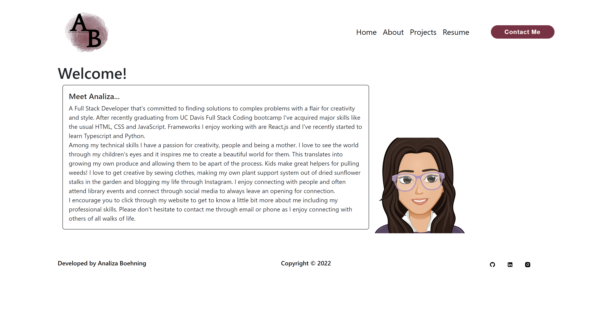

# Analiza Portofolio

An application that encompasses all my skills and background.

## Description

I've created an application that holds an overview about who I am and the technical skills I've acquired after recently graduating from UC Davis' coding bootcamp.

## Table Of Contents

- [Description](#description)
- [Installation](#installation)
- [Screenshot](#screenshot)
- [Page Link](#page-link)
- [Contact](#contact)

## Installation

- Clone repository from https://github.com/analizajb/analiza-portfolio.
- run 'npm i' to install necessary packages.
- run 'npm start' to start the server.

## Screenshot

## Page Link

https://analizajb.github.io/analiza-portfolio/

## Contact

Email: analizaboehning@gmail.com